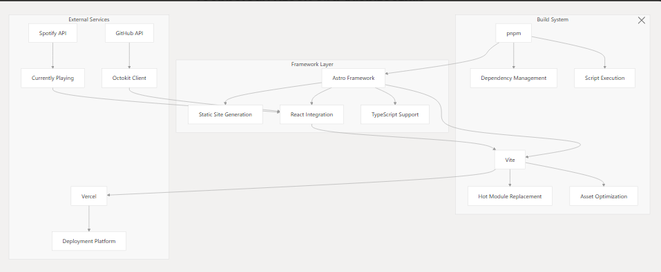

# Portfolio 2025 – Advanced Repository Overview


## 📁 **Relevant Source Files**

```text
README.md
package.json
src/constants/navigation-names.ts
src/layouts/Layout.astro
src/pages/index.astro
```

---

## 🎯 **Purpose and Scope**

Portfolio 2025 is a modern, highly interactive personal portfolio leveraging **Astro** and **React**.
The project aims to present professional experience, skills, projects, and personal branding via an animated, performant, and maintainable UI.

This document delivers a comprehensive high-level technical overview covering:

* Architectural philosophy and system organization
* Technology stack rationale
* Component structure and navigation
* Development workflow and tooling
* External service integrations
* Optimization strategies

For in-depth technical details on individual modules, refer to respective sections or code comments.

---

## 🏗️ **Technology Stack & Architecture**

Portfolio 2025 utilizes a **hybrid rendering model**, maximizing performance via Astro’s static site generation, while enabling advanced interactivity through **island architecture** and selective React hydration.

### **Core Technology Foundation**

| Category      | Technologies                                 | Role/Notes                    |
| ------------- | -------------------------------------------- | ----------------------------- |
| Framework     | `astro`, `@astrojs/react`, `@astrojs/vercel` | Site structure & deployment   |
| UI Layer      | `react`, `react-dom`, `typescript`           | Components & type safety      |
| Styling       | `tailwindcss`, `sass`, `motion`              | CSS utilities & animation     |
| External APIs | `octokit`, `spotify-api-kit`                 | GitHub & Spotify integrations |
| Build Tooling | `vite`, `pnpm`, `prettier`, `@biomejs/biome` | DX & workflow                 |

**Source highlights:**

```text
package.json (dependencies & scripts)
src/layouts/Layout.astro
```

---

### **Architecture Summary**

* **Astro Framework:**
  Static site generation (SSG) with seamless integration of React components and "islands" for targeted interactivity.
* **React UI Islands:**
  High-fidelity, client-hydrated UI pieces where needed (e.g., Hero, Skills, Terminal).
* **Vite + pnpm:**
  Lightning-fast dev builds, HMR, and modern dependency management.
* **API Integration:**
  Encapsulated data fetching via GitHub (Octokit) and Spotify API Kit.
* **TypeScript:**
  Strict typing for reliability and future scalability.

---

## 🗂️ **Application Structure & Component Organization**

Portfolio 2025 implements a **section-based layout**, orchestrated by Astro’s layout and page components.

### **Main Application Flow**

```text
src/layouts/Layout.astro    // App skeleton, navigation router, global CSS
src/pages/index.astro       // Page-level orchestrator, imports/uses all sections

src/components/
  Hero.tsx
  About.tsx
  Terminal.tsx
  Skills.tsx
  Projects.tsx
  Grid.tsx
  Profile.tsx
  Connect.tsx
  Navigation.tsx
```

* **Layout.astro** defines HTML structure, navigation transitions, and global styles.
* **index.astro** imports and renders all section components, applying client hydration where necessary:

```astro
// Example in index.astro
import Hero from '../components/Hero'
import Skills from '../components/Skills'
import Projects from '../components/Projects'
// ...
------

  <Hero client:only="react" />
  <Skills client:only="react" />
  <Projects client:only="react" />
  ```

---

### **Navigation & Content Sections**

* **Centralized Navigation System:**
  Section keys are managed in `src/constants/navigation-names.ts`, promoting consistency and decoupling between navigation and component implementation.
* **Section Mapping:**
  Each entry in `NAVIGATION_NAMES` is directly mapped to a component.

```typescript
// src/constants/navigation-names.ts
export const NAVIGATION_NAMES = [
  'ABOUT',
  'TERMINAL',
  'SKILLS',
  'PROJECTS',
  'PRINCIPLES',
  'PROFILE',
]
```

---

## 💻 **Development Workflow & Tooling**

* **Enforced package manager:**
  `pnpm` is enforced via preinstall hook.
* **Unified formatting:**
  Both `prettier` and `@biomejs/biome` are available for code formatting and linting.

### **Scripts Overview**

| Script         | Command                               | Description                  |
| -------------- | ------------------------------------- | ---------------------------- |
| `dev`          | `astro dev`                           | Run dev server (HMR enabled) |
| `build`        | `astro build`                         | Production SSG build         |
| `preview`      | `astro preview`                       | Preview built site           |
| `format`       | `prettier --write .`                  | Auto-format codebase         |
| `biome:format` | `npx @biomejs/biome format --write .` | Alternative formatter        |

```json
// package.json (excerpt)
"scripts": {
  "dev": "astro dev",
  "build": "astro build",
  "preview": "astro preview",
  "format": "prettier --write .",
  "biome:format": "npx @biomejs/biome format --write ."
}
```

---

## ⚡ **Performance and Optimization Strategy**

* **Astro’s Islands:**
  Selective hydration for interactive components only.
  Static scaffolding for layout, navigation, and static content.
* **Hydrated vs Static:**

  * **Static:** Core structure, global CSS, non-interactive elements
  * **Hydrated:** Components with user interaction, animation, or real-time updates
  * **Mixed:** Projects section is primarily server-rendered with dynamic islands as needed

```astro
<Hero client:only="react" />
<Skills client:only="react" />
<Terminal client:only="react" />
<Navigation client:only="react" />
```

---

## 🌐 **External Integrations**

* **GitHub:**
  Repository data is fetched using `@octokit/core` and exposed in the UI (Projects, Stats, etc.)
* **Spotify:**
  Uses `spotify-api-kit` to display the currently playing track in real-time.
* **Deployment:**
  Configured for Vercel via `@astrojs/vercel` for fast, global static delivery.

```json
// package.json (excerpt)
"dependencies": {
  "@octokit/core": "^5.0.0",
  "spotify-api-kit": "^1.2.3",
  "@astrojs/vercel": "^2.0.0"
}
```

---

## 🚀 **Summary**

Portfolio 2025 offers a robust foundation for a **future-proof, interactive, and performant portfolio**.
The architecture leverages Astro’s SSG, React’s interactivity, and advanced tooling for a best-in-class developer and user experience.

---

## 📚 **References**

* `package.json`
* `src/layouts/Layout.astro`
* `src/pages/index.astro`
* `src/constants/navigation-names.ts`

---

**For additional technical detail, refer to in-code comments or open a discussion/issue in the repository.**

---
